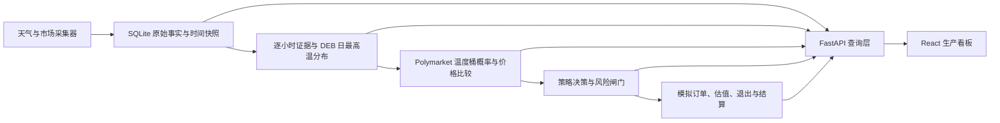

# WeatherBot

面向 Polymarket 日最高温市场的本地天气量化研究与模拟交易平台。系统将机场观测、历史观测、多模型预报、市场温度桶和真实盘口放进同一条可审计链路，并提供受控模拟账户验证策略。

> 当前状态：可采集、可分析、可模拟；实盘保持锁定。历史证据尚未证明正收益，不应把“天气关注”或正概率差直接当成买入建议。

## 项目入口

本项目只维护三份默认入口，避免每轮重新阅读全部历史：

| 文件 | 职责 |
| --- | --- |
| `AGENTS.md` | Codex/开发代理规则、安全边界和标准命令 |
| `docs/CURRENT_STATE.md` | 当前 Phase、阻塞项和唯一下一步 |
| `README.md` | 安装、启动、操作、策略含义和局限 |

外部资料先查 `docs/SOURCE_REGISTER.csv`；架构、存储和详细 UI/算法规则按需读取 `docs/` 下的索引文档。Git 是唯一代码版本历史，不再复制“最新版/最终版”源码目录。

## 当前能力

- 51 个工作台城市的机场站点、时区和结算规则注册表；尚未完成采集的城市会明确标为待接入。
- METAR、中国实况、Wunderground 历史观测、Weather.com v3 与 Open-Meteo 多模型预报。
- PolyWX 风格的城市工作台：预报、METAR、历史观测、偏差统计、抓取日志。
- DEB 日最高温分布、市场温度桶严格匹配、盘口价格与概率优势计算。
- `$40` 等自定义本金的受控模拟账户、Kelly 仓位、订单生命周期、模型保护/可成交止盈、资金曲线。
- SQLite 审计链：每次预报、观测、决策、订单、估值和结算均保留来源与时间。

## 当前结论

当前推荐策略是 `core_modal_v1`。它不是“选择预计最高温所在桶就买”，而是从模型概率最高的两个桶中寻找满足价格与执行条件的候选：

- 模型概率至少 `25%`；
- 扣除 `max(tick, spread / 2)` 后检查有效优势；具体阈值来自当前策略配置，不从 README 取值；
- 检查 YES ask、独立模型家族、模型分歧、严格桶匹配及盘口有效性；
- 每个有效的历史配对都可逐步参与偏差修正，稀疏证据向先验收缩；
- 按 Kelly 建议、账户单笔和每日金额、剩余现金、交易所最小份额共同确定可成交金额。

截至 2026-09-05，本地选中的配置为 `spr_13639230b1b3e97631aec4cf3f811749`：paper 最低优势/有效优势均为 `5%`、ask 下限 `5¢`、Kelly 系数 `0.25`、本金比例上限 `12.5%`；上一账户另有 `$2/笔` 与 `$10/日` 上限。本轮审计没有改变这些值。修改设置时，以界面与配置快照为准。

最新账户于 8 月 23 日到期。9 月 5 日补结算后的账本为：13 笔订单中 11 笔已结算（2 赢、9 输，胜率 `18.18%`，已实现 PnL `-$4.91`），零持仓，2 笔未成交。此前 `1/6` 胜、`-$2.29` 是部分结算结果，不应继续引用。8 月 14 日至最后保存的 8 月 17 日数据覆盖 49 城市、1,712 条决策，其中 14 城市的 52 条决策通过闸门。决策行可重复出现，不等于独立交易数。策略正收益尚未被证明。

当前浏览器显示调度器正在运行，由用户在两轮工作之间启动；账户仍已结束。调度器运行不等于账户续开，本轮界面与文档调整不启停服务、不创建账户或订单。

Weather.com v3、NWP run、ensemble members 依赖调度器保存；电脑关闭或调度器停止时不会继续抓数。数据/模型共享，但代码仍保留独立 live 闸门及仓位参数；限价 canary 接口已实现、尚未开放，不能声称已具备完整实盘账户管理。

## 技术架构



### 分层职责

| Layer | 职责 | 代表数据 |
| --- | --- | --- |
| 0 | 外部证据与数据契约 | 来源、字段、频率、单位、许可 |
| 1 | 城市与结算站注册表 | ICAO、时区、结算单位、规则状态 |
| 2 | 实况与 truth | METAR、China Live、PWS、WU/HKO/IEM |
| 3 | 预测 run 与成员 | Weather.com v3、Open-Meteo NWP、ensemble members |
| 4 | 派生天气证据 | hourly consensus、DEB `μ/σ`、模型轨迹 |
| 5 | 市场与订单簿 | event、bucket、token、bid/ask、tick、depth |
| 6 | 策略与决策 | bucket probability、edge、gate reasons、Kelly |
| 7 | 看板 | 城市工作台、模型分析、策略队列、订单记录 |
| 8 | 模拟执行 | 下单、成交、估值、退出、幂等 |
| 9 | 结算与验证 | PnL、Brier、CLV、ROI、回撤 |
| 10 | 小额实盘 | 当前锁定，只有完成验收后才允许 canary |

主要目录：

| 路径 | 用途 |
| --- | --- |
| `weatherbot_v3/` | 生产化采集、派生、策略、执行和风控 |
| `dashboard_server.py` | FastAPI 与看板适配层 |
| `frontend/src/` | 唯一可编辑的 React 生产看板 |
| `dashboard/` | FastAPI 兼容静态页，不再新增功能 |
| `tests/` | 单元、契约和集成测试 |
| `scripts/dev.ps1` | 唯一标准启动命令 |
| `scripts/check.ps1` | 唯一标准检查命令 |
| `tools/` | 回放与只读诊断工具 |
| `data/` | 本地运行数据 Junction，实际指向 `D:\WeatherBot\data` |
| `legacy/` | 旧版，只读参考 |

## 预测模型与概率生成

### 模型来源

| 看板名称 | 数据来源 | 在 DEB 中的角色 | 当前性质 |
| --- | --- | --- | --- |
| V3 | Weather.com v3 hourly forecast | PolyWX-aligned 先验中的主模型 | 单一确定性 run |
| ECMWF | Open-Meteo ECMWF/AIFS 或 IFS | 全球中期预报 | 独立模型家族 |
| GFS | Open-Meteo GFS + GFS ensemble | 全球预报与真实成员分布 | 确定性 + 31 members |
| ICON | Open-Meteo DWD ICON | 全球/区域预报 | 独立模型家族 |
| GEM | Open-Meteo ECCC GEM | 全球预报 | 独立模型家族 |
| JMA | Open-Meteo JMA | 亚洲区域补充 | 独立模型家族 |
| CMA/HRRR/NBM | Open-Meteo 可用模型 | 地区诊断或 fallback | 不与主六模型重复计票 |

`polywx_aligned_deb_v1` 的初始先验为：

| V3 | GFS | ECMWF | ICON | GEM | JMA |
| ---: | ---: | ---: | ---: | ---: | ---: |
| 0.484 | 0.152 | 0.104 | 0.095 | 0 | 0 |

表中是归一化前的先验系数。默认 GEM/JMA 保留诊断展示、权重为零；四个主家族齐全且没有误差证据时，归一化约为 `57.96% / 18.20% / 12.46% / 11.38%`。有模型缺失时按实际可用成分重新归一化。手工设置可覆盖先验。

这些不是永久权重。系统按城市和模型保存每次发布时刻、逐小时预报、目标日最高温及真实结算配对：

1. 零有效配对或没有 MAE：使用先验，不伪造误差。
2. 从第一个有效且可前向评分的配对起，动态权重吸收逆 MAE 表现，比例为 `0.75 × min(n/40, 1)`；加性偏差按 `n/(n+10)` 收缩，并限制在 `±2.5°C`。旧版拟合 MAE 不满足新评分契约时，不用于动态权重；下一次正常校准刷新会生成新评分，不需等待新的 10/20 天门槛。
3. 10/20 个样本是证据状态的分档，不是动态权重的启动开关。
4. 单模型份额上限至少为 `45%`，也不低于当前参与模型中最大的归一化先验份额；不能将其理解为固定 45%。

偏差修正严格发生在概率和优势之前：

```text
原始模型最高温
  -> 仅用目标日前已结算样本估计城市/模型偏差
  -> 小样本收缩与限幅
  -> 生成 DEB 分布和温度桶概率
  -> 与可成交 YES ask 比较优势
```

当前偏差按站点、模型家族、位置版本与提前量选择可用校准证据。准确度改善必须在冻结的前瞻口径下评估，不能靠事后挑城市、改阈值或重复历史模型选择证明收益。

### 样本增加会提高胜率吗？

有机会改善，但不保证。校准数据来自保存的预报和权威实况/结算配对，不依赖是否买入。多下几笔订单并不会直接让天气模型变准，同一个日期重复抓取也不等于多个独立天气样本。

需要分开看三件事：

| 问题 | 看什么 | 不能据此推断什么 |
| --- | --- | --- |
| 温度是否越来越接近实际？ | 相同站点、提前量、发布边界的前向预测误差 | MAE 小不等于每个温度桶概率准确 |
| 概率是否有用？ | 同批桶上的 Brier、log loss，以及与市场的差值 | 校准改善不保证能区分市场已经知道的天气变化 |
| 交易是否赚钱？ | 可成交价格、费用、真实成交、已实现盈亏 | 胜率高不一定赚钱，买得太贵仍会亏损 |

2026-09-05 审计发现，旧校准中存在单样本拟合后的零误差，并且评分使用完整偏差修正，而运行时使用收缩、限幅后的修正。这种评分不能作为预测准确度。本轮统一这两处契约：第一笔用零先验修正评分，后续只用发布前可用的历史证据，并使用与运行时相同的偏差公式；旧快照不改写，旧拟合误差不再伪装成新的前向评分。

这项修复是让学习依据正确，不是宣称胜率已经提高。逆 MAE 动态融合仍只是启发式方法，不是直接优化交易收益的模型；增加样本不能弥补缺失的天气信息、错误的结算站点或市场的信息优势。保持前瞻评估，不重开历史模型选择循环。

### DEB 日最高温分布

DEB 不是简单平均：

1. 按城市本地日切分每个模型的逐小时预测。
2. 取各模型对目标日的最高温，并应用只使用此前结算日训练出的偏差修正。
3. 按动态权重融合得到中心 `μ`。
4. 用模型间散布、真实 ensemble members 和历史残差估计 `σ`，最低为 `0.5°C`。
5. D+0 用已观测最高温约束 `μ` 下限，避免预测最高温低于已经发生的实况。
6. 将连续分布积分到当前 Polymarket 事件的动态温度桶；所有桶概率归一化为 1。

#### 结算取整与学习来源

概率必须按该日期市场指定的来源映射，不能把所有摄氏市场一律向下取整。2026-09-08 核对的 49 个事件中，47 个主来源为 NOAA WRH。其[官方显示程序](https://www.weather.gov/source/wrh/timeseries/obs.js?v202601121730)对温度使用 `Math.round`：例如 `28.79°C` 显示为 `29°C`，对应连续区间 `[28.5, 29.5)`，不是 `[29, 30)`。半度向较高整数取整，包括负温度。

- 新概率契约 `gaussian-cdf-rule-aligned-v3` 从市场 `resolutionSource` 识别 NOAA；高斯积分、ensemble members、实况穿桶与退出判断使用同一边界。华氏范围桶和尾桶也共享半度边界。
- 不从规则说明中的备用链接推断主来源；未核实的历史 WU/HKO 取整逻辑本轮不改。旧订单、已结算盈亏和历史快照不重写。
- NOAA 规则日不能直接拿 WU/IEM 温度充当精确校准真值。NOAA 原始日最高温尚无授权接入时，缺失保持缺失；Gamma 的赢家/输家可用于结算订单，但赢家桶不是可反推的连续温度，不能填入偏差训练。
- 本轮过滤只作用于之后的训练刷新，未删除已有 WU 校准文件，也未完成按结算来源切换 bias/MAE 的独立版本选择。因此，旧 WU 校准仍可能影响 NOAA 日的预测；不能把这项修复理解成 NOAA 校准已经接通。
- 动态权重、优势阈值、仓位和退出成交条件不因此改变。此修复减少相邻桶误配，不代表预测冷偏已消除，也不代表胜率已被证明提高。

看板“模型分析”中的：

- **模型排名**：展示当前权重、预测最高温、真实配对样本和 MAE；
- **预测轨迹**：展示每个模型随新 run 如何修订目标日最高温；
- **概率桶**：展示模型对每个结算区间的概率，不是市场价格，也不是买入建议。

### 无泄漏原则

任何回测或动态权重只能使用预测发布时已经可见的数据。未来 run、后来修订的预报、结算后才出现的 truth 都不能反向进入当时决策。订单簿回放同样只允许使用决策时刻之前的 quote。

## 首次安装

在 PowerShell 中：

```powershell
cd C:\Users\Administrator\Documents\polymarket\weatherbot
python -m venv .venv
.\.venv\Scripts\python.exe -m pip install -r requirements.txt

cd frontend
npm install
```

密钥只放项目根目录 `.env`，不要写入 README、`config.json` 或 Git：

```dotenv
LIVE_TRADING=false
WEATHER_COM_API_KEY=***
WUNDERGROUND_API_KEY=***
VISUAL_CROSSING_KEY=***
MINIMAX_API_KEY=***
FEISHU_WEBHOOK_URL=***
```

没有某个可选密钥时，对应来源会明确降级或禁用，不会伪造数据。

Visual Crossing Pro 已预留完整配置、连接测试和历史 truth 导入接口。可在看板设置中填写并测试，也可在 `.env` 中配置 `VISUAL_CROSSING_KEY` 后执行：

```powershell
.\.venv\Scripts\python.exe -m weatherbot_v3.cli truth-backfill `
  --city chicago --start-date 2026-07-01 --end-date 2026-07-07
```

连接测试不仅检查 HTTP 状态，还要求返回有效的 `days[0].tempmax`。Visual Crossing 当前只用于 paper/历史校准补充，不替代 Wunderground/HKO 正式结算 truth，也不能单独解锁实盘。

## 启动项目

标准命令：

```powershell
cd C:\Users\Administrator\Documents\polymarket\weatherbot
.\scripts\dev.ps1
```

该命令调用同一个桌面启动器，因此命令行和桌面快捷方式不会形成两套启动逻辑。

### 推荐：桌面一键启动

本机已经安装启动器后，双击桌面的 **WeatherBot 看板** 即可：

1. 校验端口 `8765/5173` 上是否已是本项目，避免重复启动或误开旧版本；
2. 缺少服务时隐藏启动 FastAPI 后端和 Vite 前端，并等待健康检查通过；
3. 显式启动数据调度器；
4. 用默认浏览器打开 <http://127.0.0.1:5173/>。

重复点击不会再开第二套服务，也不会让 Vite 自动漂移到 `5174`。启动失败时会弹出明确提示；日志在：

```text
D:\WeatherBot\logs\launcher.log
D:\WeatherBot\logs\backend.log
D:\WeatherBot\logs\frontend.log
```

首次安装或重新生成启动器：

```powershell
cd C:\Users\Administrator\Documents\polymarket\weatherbot
powershell -ExecutionPolicy Bypass -File .\scripts\install_weatherbot_launcher.ps1
```

启动器本体位于 `D:\WeatherBot\Launcher\WeatherBotLauncher.exe`，桌面只是快捷方式。它复用现有 `.venv`、`frontend/node_modules` 和 D 盘数据，不会把数据库或密钥打进 EXE。

### 手动启动

#### 1. 后端

打开第一个 PowerShell：

```powershell
cd C:\Users\Administrator\Documents\polymarket\weatherbot
.\.venv\Scripts\python.exe -m uvicorn dashboard_server:app --host 127.0.0.1 --port 8765
```

#### 2. 前端

打开第二个 PowerShell：

```powershell
cd C:\Users\Administrator\Documents\polymarket\weatherbot\frontend
npm run dev -- --host 127.0.0.1 --port 5173
```

浏览器打开：<http://127.0.0.1:5173/>

#### 3. 启动调度器

后端默认不会自动抓取。以下启停命令仅供本机操作；公网看板不能启停调度器。当前调度器已由用户启动并正在运行，无需因本轮发布重复启动。需要启动时，在本机执行：

```powershell
Invoke-RestMethod -Method Post http://127.0.0.1:8765/api/scheduler/start
```

检查状态：

```powershell
Invoke-RestMethod http://127.0.0.1:8765/api/scheduler/status
Invoke-RestMethod http://127.0.0.1:8765/api/source-health
```

停止调度器：

```powershell
Invoke-RestMethod -Method Post http://127.0.0.1:8765/api/scheduler/stop
```

## 公网访问（前后端分离）

现有公网前端：<https://www.polywxx.org>，由 Vercel 托管。2026-09-05 的看板精简已发布：UI 源码提交 `b812d9b` 已推送 GitHub `main` 与开发分支，Vercel 生产构建通过，域名上的 JS/CSS 与本地构建一致；模型分析、订单记录和只读访问已核对。

- SQLite、FastAPI、采集器、策略和执行仍在本机；发布前端不会迁移后端或启动交易。
- 浏览器通过同源 `/api/*` 访问 Vercel 服务端代理，再经受保护的 `https://api.polywxx.org` 读取本机 FastAPI。
- 公网代理只允许 `GET`、`HEAD`、`OPTIONS`，其他方法返回 `405 public_dashboard_read_only`。公网不能保存设置、启停调度器、启动策略、创建 paper validation、买入或执行任何写操作。
- 本机或通道离线时，代理明确返回上游不可用；当前代理没有离线快照回退，不能把旧数据冒充实时成功。

`WEATHERBOT_ORIGIN_TOKEN` 仅用于 Vercel 服务端与本机后端之间的鉴权，不下发浏览器；Vercel 的 `WEATHERBOT_ORIGIN_URL` 指向上述源站。前端保持同源 API，不把令牌写入 `VITE_*` 变量。本轮仅修正文档口径，不改变权限设计。

## 存储治理

生产数据库位于 `D:\WeatherBot\data\weatherbot_v3.db`。先做快速只读估算：

旧 SQLite 备份已使用 NTFS 透明 LZX 压缩：逻辑大小约 `24.32GB`，实际占用约 `2.37GB`，不影响恢复和校验。生产数据库本体未压缩、未删除、未 VACUUM。

```powershell
.\.venv\Scripts\python.exe -m weatherbot_v3.cli storage-audit --before-days 30
```

预演归档（默认不改数据库）：

```powershell
.\.venv\Scripts\python.exe -m weatherbot_v3.cli storage-archive --before-days 30
```

真正执行前必须停止调度器和后端并另做数据库备份。`--apply` 会先把旧的重复 `raw_json` 写入带逐行校验和的 gzip 归档，归档完成后才把对应数据库字段置空；结构化盘口、逐小时成员、价格历史和预测结果不会删除：

```powershell
.\.venv\Scripts\python.exe -m weatherbot_v3.cli storage-archive --before-days 30 --apply
```

恢复归档：

```powershell
.\.venv\Scripts\python.exe -m weatherbot_v3.cli storage-restore `
  --archive-path D:\WeatherBot\data\archive\storage-maintenance\<run>\MANIFEST.json --apply
```

清空字段不会立即缩小 SQLite 文件；验证归档后还要在停机窗口单独运行 SQLite 压缩。不要在调度器运行时执行 VACUUM。

## 日常操作

### 左侧城市栏

- 搜索城市名或 ICAO 机场代码。
- 分组下拉支持按洲、时区、字母浏览；每组有独立标题与城市数。
- 城市温度是最近可用观测，不等于该日最终结算高温。

### 中间天气工作台

1. **预报**：独立显示中国实况、PWS、METAR、历史观测、本系统预报和云量。没有真实值的系列不会补零。
2. **METAR**：机场原始报文和解析字段。它是日内实况证据，不自动等同于 Wunderground 结算值。
3. **历史观测**：Wunderground/weather.com 历史序列；香港采用 HKO 规则。缺失时诚实显示空态。
4. **偏差统计**：`观测 - 预报`。METAR 按最近整点匹配；历史观测按最近整点匹配并去重，避免同一小时重复计数。
5. **抓取日志**：只显示当前城市的最近记录，检查来源、状态、耗时和错误；天气、观测、盘口、信号按消息语义归类。

各观测表的气压统一显示为 `hPa`；温度、风速和能见度按城市显示习惯转换。

DEB 的 `μ ± σ` 表示日最高温预测中心和不确定度。概率桶是模型分布，不是收益保证。只有市场桶严格匹配且真实 ask、价差、流动性和风控全部通过时，才会成为模拟候选。

### 右侧交易台

右侧仅保留账户与策略设置。以下保存设置、启动策略和买入操作仅限本机；公网只能查看。批量买入入口仅在至少 2 组可买候选时显示，仍须逐组通过原有执行和风控检查。

1. 展开“策略设置”。
2. 输入模拟本金和单笔上限。
3. 单选一个入场策略并选择退出方式。
4. 设置“最低优势”；当前配置为 `5%`，账户启动时固定快照，并在成交前复核。
5. 确认本机调度器正在运行；调度器状态与账户状态分别判断。
6. 点击“启动策略”。到期或停止不会自动续开；重新启动会新建账户，不改写历史。

当前建议只使用 `核心高概率桶`。旧的单桶 EV、相邻网格和低价尾部策略仍保留用于研究，但默认关闭，因为历史证据不足。每批模拟只允许一个入场策略：动态核心与低价尾部会在 `10–15¢` 区间重叠，单桶和相邻网格也可能命中同一 token；在组合级去重和风险分配尚未验证前，不允许把它们自由叠加。

模拟账户启动后会固定策略版本，避免测试期间参数漂移。策略队列展示当前城市的决策；模拟订单页展示：

- 入场时间、城市、日期、温度桶和策略；
- 买入价、份额、成本、当前买一价；
- 未实现/已实现 PnL 与状态；
- Polymarket 对应市场链接；
- 资金曲线。

账户停止或到期后，订单和资金曲线仍显示最近账户，不会退回到当前城市/日期的空列表。订单支持按状态筛选；未成交不显示虚假的零元浮盈。盘口或决策过期后不可执行；点击失败会显示具体原因，读取失败与真正的“暂无订单”分开处理。

本机“模型分析”默认自动权重。可直接编辑百分比，编辑后进入自定义状态；点击保存后生效，再勾选自动权重并保存可恢复动态模式。权重会归一化，改变权重不会改写历史预测。公网显示已保存的权重与模型轨迹，不显示无法操作的权重输入框和保存按钮。

### 成交可信性

- 查订单簿必须匹配目标 YES token，不能在缺失时借用同市场另一 outcome 的报价；这一点遵循 [Polymarket 订单簿契约](https://docs.polymarket.com/api-reference/market-data/get-order-book) 与 [官方 Python 客户端](https://github.com/Polymarket/py-clob-client-v2)。
- 单桶和阶梯的订单/成交记录使用同一事务，失败一起回滚，重试不能产生半笔账。
- 退出只检查最新订单簿；最新买盘为空或抓取失败时，不能回退到旧挂单制造卖出。
- 模型失效的两次确认必须来自决策实际引用的不同预测；单纯新增一条预测但未产生新决策不算第二次确认。

## 策略实现

### 入场策略

| 策略 | 实现逻辑 | 当前建议 |
| --- | --- | --- |
| `core_modal_v1` | 只检查模型概率 Top-2 桶，再按全局最低优势、校准、模型分歧和盘口筛选 | 推荐用于当前 paper cohort |
| `single_bucket_ev` | 每个桶独立评估，但必须达到全局最低交易优势 | 研究对照，容易偏向便宜桶 |
| `ladder_grid` | 以 `μ` 最近桶为中心，加左右相邻桶；三桶必须原子执行且逐桶达到全局门槛 | 研究对照，资金占用和相关性更高 |
| `tail_buying` | 只看 ask `<=15¢` 且概率差 `>=10%` 的长尾桶 | 高方差研究策略，要求 20 个独立结算日 |

策略不是自由叠加的复选框。一个模拟 cohort 固定一个入场策略和参数快照，避免同一 token 被多策略重复买入，也便于比较每种方法的真实结果。

“最低交易优势”是所有入场策略的共同下限，默认 `8%`；核心策略还要求扣除 `max(tick, spread / 2)` 后仍达到该值。策略自身若有更严格门槛（例如尾部策略 `10%`），取两者较高者。修改配置不会篡改已启动 cohort 的参数快照，新阈值从下一批策略运行开始生效。

### 概率、EV 与有效优势

```text
model_probability = DEB 分布落入该市场桶的概率
market_probability ≈ 当前可买入的 YES ask
raw_edge = model_probability - best_ask
execution_buffer = max(tick_size, spread / 2)
effective_edge = raw_edge - execution_buffer
```

`effective_edge > 0` 只说明模型比市场更乐观。它还不是订单。系统随后检查：

```text
结算规则与机场站匹配
  -> 模型/校准成熟度
  -> 市场桶严格匹配
  -> token、tick、orderMinSize
  -> bid/ask、spread、depth、quote age
  -> 重复订单与日额度
  -> Kelly 仓位是否大于最小可成交金额
```

### Kelly 仓位

二元 YES 合约的 full Kelly：

```text
b = 1 / ask - 1
kelly_fraction = (p * b - (1 - p)) / b
```

项目只使用 `15%` fractional Kelly：

```text
position = max(0, kelly_fraction) * 0.15 * bankroll
position <= min(bankroll * 5%, max_per_trade_usd)
```

订单还必须满足市场最小份额，因此 `$40` 本金并不保证每个合格信号都能成交。样本不足会进入校准不确定性和实盘成熟度判断，但不再额外把 10 至 19 个样本的模拟仓位机械减半。

## 退出与结算

### 持有至结算

忽略盘中噪声，等待 Polymarket 官方结果。适合先验证概率质量。

### 模型保护退出

仅用于模拟盘：

- 已观测最高温使目标桶不可能时，尝试按真实买一价退出；
- 仅模型转弱时，需要连续两次概率低于 `8%`；
- 还要满足最短持有时间、盘口新鲜度、深度和卖价不差于模型公允价。

这不是传统固定百分比止损，避免薄盘口的短期价差把正常波动固化成损失。

### 盈利止盈 + 模型保护

仅用于新启动的模拟批次，旧批次参数保持冻结：

- 只按真实可成交的 YES `best bid` 计算，不使用中间价、最新成交价或页面估值；
- 至少持有 `15` 分钟；
- 可成交利润同时达到入场成本的 `5%`、`$0.05`，且卖价至少比入场价高一个 tick；
- 买一档深度必须覆盖全部份额，盘口时间不得超过 `300` 秒；
- 未达到止盈时，实况穿桶和模型连续失效保护仍然生效。

该模式用于检验盘中信息差是否可兑现，不代表它一定优于持有至结算。应分别比较两个模拟 cohort 的成交率、已实现 PnL、错失结算收益和最大回撤。

## 如何读“概率优势”

```text
原始优势 = 模型概率 - 当前 YES ask
有效优势 = 原始优势 - max(tick, spread / 2)
```

正数只表示模型比市场更乐观，不代表可以买。真正的候选还必须满足模型排名、校准、结算 truth、模型分歧、盘口、最小订单和 Kelly 大小等条件。

## 数据源职责

| 来源 | 角色 | 是否直接解锁实盘 |
| --- | --- | --- |
| AWC/IEM METAR | 机场实况、日内最高温下限 | 否 |
| NOAA WRH time series | 当前多数事件指定的日最高温来源 | 尚缺授权历史接入，不能用赢家桶替代 |
| Wunderground daily/hourly | WU 主来源事件的历史/结算 truth 候选 | 需覆盖与核验；NOAA 备用来源需满足事件条件 |
| HKO Daily Extract | 香港结算 truth | 需规则匹配 |
| Weather.com v3 | 主展示预报与 DEB 模型之一 | 否 |
| Open-Meteo ECMWF/GFS/ICON/GEM/JMA | 独立 NWP 与 DEB | 否 |
| 中国天气实况 | 中国城市短临辅助 | 否 |
| PWS | 温度走势与峰值拐点辅助 | 否 |
| Visual Crossing Pro | 可选的历史站点温度与 paper 校准补充 | 否 |
| Polymarket Gamma/CLOB | 市场、token、盘口、结算 | 交易必需 |

## 与参考项目的取舍

- [alteregoeth-ai/weatherbot](https://github.com/alteregoeth-ai/weatherbot)：借鉴机场站点、EV、Kelly、模拟和价差过滤；不沿用 JSON 单体状态和未经验证的概率校准。
- [suislanchez/polymarket-kalshi-weather-bot](https://github.com/suislanchez/polymarket-kalshi-weather-bot)：借鉴 31-member ensemble、8% edge、15% fractional Kelly、Brier 和三栏看板；不混入 BTC 策略。
- [PolyWeather](https://github.com/yangyuan-zhen/PolyWeather)：借鉴 settlement-oriented 观测、DEB、严格桶匹配、EMOS shadow 和事件驱动展示；不把未公开的生产阈值当作已验证事实。
- [Polymarket 官方订单文档](https://docs.polymarket.com/trading/orders/create)：实盘必须遵守限价、tick、minimum size、余额、订单状态和重复订单约束。

## 当前局限

- 城市级无泄漏样本仍少；从首个有效配对渐进学习不能据此判断长期胜率。
- 早期回放缺少完整历史订单簿，无法为所有案例复现当时真实成交、滑点、退出和 ROI。
- 当前已有模拟证据没有证明模型持续优于市场；Brier、CLV 和 PnL 都需要按策略版本与城市分 cohort 评估。
- 很多候选会被模型分歧、truth 覆盖、最小订单、盘口价差或深度阻塞。这些是交易约束，不应为了增加订单而隐藏。
- V3 已在部分城市达到 10 个配对样本，但并非所有城市和模型都具备可审计 MAE；动态权重仍处于早期收敛阶段。
- 当前只有 GFS 路径稳定保存真实 ensemble members；其他模型多数仍是确定性 run，分布尾部依赖校准核。
- PWS 取决于独立 API entitlement；无权限时保持禁用。
- Wunderground 可访问性和规则页变化仍可能造成 truth 延迟；IEM 只能作为近似，不等同于正式结算源。
- 薄盘口中的 best bid 可能跳变或缺失，持仓估值和止盈都必须按可成交深度解释。

因此当前应按已冻结的前瞻口径评估预测质量与真实成交结果，不重开历史模型选择。不要为了产生订单而放宽风控，也不要把“样本更多”本身当成继续投入的证据。

### 看板性能与操作

- 顶部仅保留一个主题切换图标和“系统设置”唯一入口；右侧不重复放置系统设置。说明集中到问号提示，避免常驻铺文。
- 刷新只重读当前活跃天气、盘口、策略和订单视图的已保存数据，不触发采集、不买入，也不启动策略。
- 日期使用前后箭头切换；窄屏页签与图表刻度保持可读。空日期显示空态，但不隐藏日期和页签导航。
- 订单默认请求 `compact=true`：只省略原始报文及重复 JSON 字段，不删除数据库证据，也不改变订单、盈亏或曲线计算。此账户响应从约 2.4MB 降至 154KB；诊断仍可调用不带该参数的完整接口。
- 静止的抓取状态每 30 秒更新，抓取进行中每 3 秒更新；未运行账户的订单每 60 秒更新，运行时保持 30 秒。交易新鲜度和风控门槛不变。
- 离开城市时取消其浏览器读取请求，保留导航与账户；天气区域只展示新城市的数据。设置页按需加载，手机端可在天气标题处直接选择城市。
- 交易台订单页分别显示结算胜率和已实现盈亏；模型分析将“历史 MAE”和“前向 MAE”分开，具体评分口径与样本量放在悬停提示，不添加常驻解释横幅。

## 待改进路线

### P0：完成模拟验证闭环

- 连续运行并保存至少 30 个权威结算的独立模拟仓位；
- 按城市、提前量、策略版本、价格区间和模型成熟度拆分 ROI/Brier/CLV；
- 补齐可重放的订单簿快照，区分“模型判断正确”与“盘口无法成交”；
- 验证三种退出方式的已实现 PnL、错失结算收益和最大回撤。

### P1：提升概率质量

- 扩大 Weather.com v3/JMA/ECMWF 等模型的无泄漏历史配对；
- 增加更多真实 ensemble member 来源，减少仅靠高斯核估计尾部；
- 按城市、季节、提前量和天气形势做分层校准；
- 对 bucket distribution 使用 reliability diagram、Brier decomposition 和 log loss，而不是只看胜率。

### P2：生产可靠性

- 对采集器增加更长周期的错误预算、退避和数据缺口告警；
- 固化 truth coverage、预测新鲜度、订单簿新鲜度和重复订单的运行验收；
- 模拟连续达标后，仅开放 `$1-$2` BUY YES 限价 canary；
- 实盘仍需账户持仓/链上结算核对、完整退出与异常通知验收；限价提交、余额/授权检查、撤单与订单复查已实现。

## 验证命令

```powershell
cd C:\Users\Administrator\Documents\polymarket\weatherbot
.\.venv\Scripts\python.exe -m unittest tests.test_v3_core
.\.venv\Scripts\python.exe -m unittest tests.test_polywx_contract

cd frontend
npm run build
```

无泄漏策略回放示例：

```powershell
cd C:\Users\Administrator\Documents\polymarket\weatherbot
.\.venv\Scripts\python.exe tools\backtest_core_modal_strategy.py `
  --cities chicago shanghai tokyo singapore `
  --start 2026-07-18 --end 2026-07-22 `
  --output audits\core-modal-review.json
```

## 常见问题

### 8765 或 5173 端口被占用

```powershell
Get-NetTCPConnection -LocalPort 8765 -State Listen | Select-Object LocalAddress,LocalPort,OwningProcess
Stop-Process -Id <OwningProcess> -Force
```

只停止确认属于 WeatherBot 的 PID。Vite 若发现 5173 被占用会自动切到 5174，应优先清理旧进程，避免打开错版本。

### 看板数据不更新

依次检查：

```powershell
Invoke-RestMethod http://127.0.0.1:8765/api/scheduler/status
Invoke-RestMethod http://127.0.0.1:8765/api/source-health
Invoke-RestMethod http://127.0.0.1:8765/api/dashboard
```

然后打开当前城市的“抓取日志”。不要只看顶部“刷新成功”，要确认对应 source 的最新时间和状态。

### 实盘

`LIVE_TRADING=false` 是默认且必须保持的状态。当前版本尚未达到实盘验收门槛，也不承诺稳定盈利。

后端已提供 **BUY YES / GTC 限价 canary** 实现，生产调度器不会调用它。`live_execution.py` 使用现有 `signal_decisions` 的决策、策略版本和参数哈希，不接受客户端指定概率或价格；`clob_trading.py` 使用官方 V2 SDK 签名、鉴权和提交。

可选依赖独立安装，不影响天气采集和模拟：

```powershell
.\.venv\Scripts\python.exe -m pip install -r requirements-live.txt
```

钱包参数见 `.env.example`：`POLY_PRIVATE_KEY`、`POLY_API_KEY`、`POLY_API_SECRET`、`POLY_API_PASSPHRASE`、`POLY_FUNDER`、`POLY_SIGNATURE_TYPE`。只配置在本机后端，不能放进前端环境变量、GitHub、Vercel 或聊天。系统不会自动生成 API 凭据、部署钱包、发起授权或转账；签名类型必须与实际钱包相符。

| 本地接口 | 用途 |
| --- | --- |
| `GET /api/live/status` | 开关、实现版本、canary 限额和是否配置钱包，不返回密钥 |
| `POST /api/live/orders/preview` | 传入 `decision_id`、`strategy_revision_id` 和可选 `amount`；通过决策检查后查询余额/盘口，不签名、不提交 |
| `POST /api/v3/live-order` | 同上，另需 `confirm=true`；当前仍被关闭开关和生产验收锁阻止 |
| `GET /api/live/orders` | 查询本地记录 |
| `POST /api/live/orders/{id}/reconcile` | `confirm=true`，查询交易所状态并核对 token、方向、份额和限价 |
| `POST /api/live/orders/{id}/cancel` | `confirm=true`，撤销指定订单；撤单确认后还需复查是否部分成交 |

这些接口只接受 loopback 客户端和本地主机名，公网不允许访问。预览不是离线演示：配置完整、决策合格时会发起鉴权只读请求。本次开发仅使用隔离测试凭据，未鉴权生产账户、未提交真实订单。

提交前重新检查地区可用性、YES/NO 映射、neg-risk、策略版本、报价新鲜度、优势、tick、最小份额、深度、余额、授权及现有仓位限制。先事务落库预留额度，再签名保存订单 hash，最后单次 POST。超时记为 `unknown` 并继续占用额度，不自动重发；同一决策重复点击不会重复提交。撤单响应不代表零成交，须通过复查才释放额度。

**边界**：此版本不是完整自动实盘系统，尚无自动 SELL、链上成交/结算与账户权益闭环。未解决订单保守占用风险额度；`matched` 不代表链上结算完成。`LIVE_EXECUTION_PRODUCTION_READY=false` 保留，不因安装 SDK 或填入密钥而解锁。

### 公网打不开或未来日期报价未刷新

- Vercel 只托管前端，API 仍通过 Cloudflare Tunnel 连接笔记本。隧道在线但本地 `8765` 服务退出时，公网仍会出现 502；先启动桌面 WeatherBot，再检查 `/api/healthz` 和调度器。
- “报价未刷新”判断的是订单簿时间，不是市场目标日期。9 月 7 日的市场仍可交易，9 月 6 日抓取的报价也可能已陈旧。顶部刷新只重读数据，持续抓取依赖调度器。
- 当前项目使用全球版 Gamma/CLOB，不是 `polymarket.us` 的交易接口。两套服务独立；美国站维护不能直接解释全球版盘口状态。地区限制以实际请求出口与官方规则为准，不能通过更换代理规避。

参考：[官方 Python V2 SDK](https://github.com/Polymarket/py-clob-client-v2)、[全球版服务状态](https://status.polymarket.com/)、[Polymarket US API](https://docs.polymarket.us/api-reference/introduction)。
