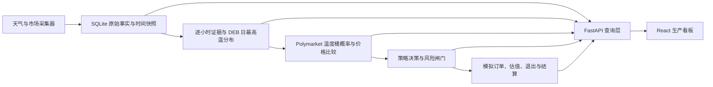

# WeatherBot

面向 Polymarket 日最高温市场的本地天气量化研究与模拟交易平台。系统将机场观测、历史观测、多模型预报、市场温度桶和真实盘口放进同一条可审计链路，并提供受控模拟账户验证策略。

> 当前状态：可采集、可分析、可模拟；实盘保持锁定。历史证据尚未证明正收益，不应把“天气关注”或正概率差直接当成买入建议。

## 项目入口

本项目只维护三份默认入口，避免每轮重新阅读全部历史：

| 文件 | 职责 |
| --- | --- |
| `AGENTS.md` | Codex/开发代理规则、安全边界和标准命令 |
| `docs/CURRENT_STATE.md` | 当前 Phase、阻塞项和唯一下一步 |
| `README.md` | 安装、启动、操作、策略含义和局限 |

外部资料先查 `docs/SOURCE_REGISTER.csv`；架构、存储和详细 UI/算法规则按需读取 `docs/` 下的索引文档。Git 是唯一代码版本历史，不再复制“最新版/最终版”源码目录。

## 当前能力

- 51 个工作台城市的机场站点、时区和结算规则注册表；尚未完成采集的城市会明确标为待接入。
- METAR、中国实况、Wunderground 历史观测、Weather.com v3 与 Open-Meteo 多模型预报。
- PolyWX 风格的城市工作台：预报、METAR、历史观测、偏差统计、抓取日志。
- DEB 日最高温分布、市场温度桶严格匹配、盘口价格与概率优势计算。
- `$40` 等自定义本金的受控模拟账户、Kelly 仓位、订单生命周期、模型保护/可成交止盈、资金曲线。
- SQLite 审计链：每次预报、观测、决策、订单、估值和结算均保留来源与时间。

## 当前结论

当前推荐策略是 `core_modal_v1`。它不是“选择预计最高温所在桶就买”，而是从模型概率最高的两个桶中寻找满足价格与执行条件的候选：

- 模型概率至少 `25%`；
- 扣除 `max(tick, spread / 2)` 后，有效优势至少 `8%`；
- YES ask 至少 `10¢`，避免极低价长尾把相对误差放大；
- 至少 4 个独立模型家族，校准权重覆盖率至少 `80%`；
- 模拟盘模型分歧不超过 `4.5°C`，成熟/实盘门槛为 `1.5°C`；
- 10 个独立预测与结算配对样本可进入受控模拟，仓位乘数为 `0.5`；
- 20 个独立样本才属于成熟校准，实盘仍需额外通过 truth、盘口、回撤和运行稳定性门槛；
- 仓位使用 `15% fractional Kelly`，单笔不超过本金的 `5%`。

历史证据仍不足以证明正收益。2026-07-18 至 2026-07-22 的无泄漏回放有 113 个有效案例，Top-1 命中率 `27.43%`、Top-2 `45.13%`、多分类 Brier `0.6968`，但没有可按当时盘口复现的成交样本。项目早期模拟订单也曾出现明显亏损，因此当前用途是收集可审计 paper 证据，不是开启实盘。

Weather.com v3、各 NWP run 和真实 ensemble members 会随调度器持续保存。Wunderground/HKO truth 到齐后，系统用仅包含当时可见信息的配对样本更新模型误差。当前 Shanghai v3 已达到 `n=10`，7 日 MAE 约 `1.21°C`，可参与受控动态权重，但尚未达到成熟门槛。

## 技术架构



### 分层职责

| Layer | 职责 | 代表数据 |
| --- | --- | --- |
| 0 | 外部证据与数据契约 | 来源、字段、频率、单位、许可 |
| 1 | 城市与结算站注册表 | ICAO、时区、结算单位、规则状态 |
| 2 | 实况与 truth | METAR、China Live、PWS、WU/HKO/IEM |
| 3 | 预测 run 与成员 | Weather.com v3、Open-Meteo NWP、ensemble members |
| 4 | 派生天气证据 | hourly consensus、DEB `μ/σ`、模型轨迹 |
| 5 | 市场与订单簿 | event、bucket、token、bid/ask、tick、depth |
| 6 | 策略与决策 | bucket probability、edge、gate reasons、Kelly |
| 7 | 看板 | 城市工作台、模型分析、策略队列、订单记录 |
| 8 | 模拟执行 | 下单、成交、估值、退出、幂等 |
| 9 | 结算与验证 | PnL、Brier、CLV、ROI、回撤 |
| 10 | 小额实盘 | 当前锁定，只有完成验收后才允许 canary |

主要目录：

| 路径 | 用途 |
| --- | --- |
| `weatherbot_v3/` | 生产化采集、派生、策略、执行和风控 |
| `dashboard_server.py` | FastAPI 与看板适配层 |
| `frontend/src/` | 唯一可编辑的 React 生产看板 |
| `dashboard/` | FastAPI 兼容静态页，不再新增功能 |
| `tests/` | 单元、契约和集成测试 |
| `scripts/dev.ps1` | 唯一标准启动命令 |
| `scripts/check.ps1` | 唯一标准检查命令 |
| `tools/` | 回放与只读诊断工具 |
| `data/` | 本地运行数据 Junction，实际指向 `D:\WeatherBot\data` |
| `legacy/` | 旧版，只读参考 |

## 预测模型与概率生成

### 模型来源

| 看板名称 | 数据来源 | 在 DEB 中的角色 | 当前性质 |
| --- | --- | --- | --- |
| V3 | Weather.com v3 hourly forecast | PolyWX-aligned 先验中的主模型 | 单一确定性 run |
| ECMWF | Open-Meteo ECMWF/AIFS 或 IFS | 全球中期预报 | 独立模型家族 |
| GFS | Open-Meteo GFS + GFS ensemble | 全球预报与真实成员分布 | 确定性 + 31 members |
| ICON | Open-Meteo DWD ICON | 全球/区域预报 | 独立模型家族 |
| GEM | Open-Meteo ECCC GEM | 全球预报 | 独立模型家族 |
| JMA | Open-Meteo JMA | 亚洲区域补充 | 独立模型家族 |
| CMA/HRRR/NBM | Open-Meteo 可用模型 | 地区诊断或 fallback | 不与主六模型重复计票 |

`polywx_aligned_deb_v1` 的初始先验为：

| V3 | GFS | ECMWF | ICON | GEM | JMA |
| ---: | ---: | ---: | ---: | ---: | ---: |
| 48.4% | 15.2% | 10.4% | 9.5% | 9.3% | 7.3% |

这些不是永久权重。系统按城市和模型保存每次发布时刻、逐小时预报、目标日最高温及真实结算配对：

1. 少于 10 个无泄漏配对样本：保留先验并继续采集，不把同一预测的重复快照当成独立样本。
2. 10 至 19 个样本：用 `prior_inverse_mae_shrinkage_v1` 将近期误差逐步混入先验，可进入半仓模拟。
3. 20 个及以上样本：允许使用成熟误差和 additive bias correction，但仍不代表可实盘。
4. 40 个样本前动态表现权重继续渐进收敛，单模型权重上限为 `45%`，避免小样本模型垄断融合。

### DEB 日最高温分布

DEB 不是简单平均：

1. 按城市本地日切分每个模型的逐小时预测。
2. 取各模型对目标日的最高温，并应用只使用此前结算日训练出的偏差修正。
3. 按动态权重融合得到中心 `μ`。
4. 用模型间散布、真实 ensemble members 和历史残差估计 `σ`，最低为 `0.5°C`。
5. D+0 用已观测最高温约束 `μ` 下限，避免预测最高温低于已经发生的实况。
6. 将连续分布积分到当前 Polymarket 事件的动态温度桶；所有桶概率归一化为 1。

看板“模型分析”中的：

- **模型排名**：展示当前权重、预测最高温、真实配对样本和 MAE；
- **预测轨迹**：展示每个模型随新 run 如何修订目标日最高温；
- **概率桶**：展示模型对每个结算区间的概率，不是市场价格，也不是买入建议。

### 无泄漏原则

任何回测或动态权重只能使用预测发布时已经可见的数据。未来 run、后来修订的预报、结算后才出现的 truth 都不能反向进入当时决策。订单簿回放同样只允许使用决策时刻之前的 quote。

## 首次安装

在 PowerShell 中：

```powershell
cd C:\Users\Administrator\Documents\polymarket\weatherbot
python -m venv .venv
.\.venv\Scripts\python.exe -m pip install -r requirements.txt

cd frontend
npm install
```

密钥只放项目根目录 `.env`，不要写入 README、`config.json` 或 Git：

```dotenv
LIVE_TRADING=false
WEATHER_COM_API_KEY=***
WUNDERGROUND_API_KEY=***
MINIMAX_API_KEY=***
FEISHU_WEBHOOK_URL=***
```

没有某个可选密钥时，对应来源会明确降级或禁用，不会伪造数据。

## 启动项目

标准命令：

```powershell
cd C:\Users\Administrator\Documents\polymarket\weatherbot
.\scripts\dev.ps1
```

该命令调用同一个桌面启动器，因此命令行和桌面快捷方式不会形成两套启动逻辑。

### 推荐：桌面一键启动

本机已经安装启动器后，双击桌面的 **WeatherBot 看板** 即可：

1. 校验端口 `8765/5173` 上是否已是本项目，避免重复启动或误开旧版本；
2. 缺少服务时隐藏启动 FastAPI 后端和 Vite 前端，并等待健康检查通过；
3. 显式启动数据调度器；
4. 用默认浏览器打开 <http://127.0.0.1:5173/>。

重复点击不会再开第二套服务，也不会让 Vite 自动漂移到 `5174`。启动失败时会弹出明确提示；日志在：

```text
D:\WeatherBot\logs\launcher.log
D:\WeatherBot\logs\backend.log
D:\WeatherBot\logs\frontend.log
```

首次安装或重新生成启动器：

```powershell
cd C:\Users\Administrator\Documents\polymarket\weatherbot
powershell -ExecutionPolicy Bypass -File .\scripts\install_weatherbot_launcher.ps1
```

启动器本体位于 `D:\WeatherBot\Launcher\WeatherBotLauncher.exe`，桌面只是快捷方式。它复用现有 `.venv`、`frontend/node_modules` 和 D 盘数据，不会把数据库或密钥打进 EXE。

### 手动启动

#### 1. 后端

打开第一个 PowerShell：

```powershell
cd C:\Users\Administrator\Documents\polymarket\weatherbot
.\.venv\Scripts\python.exe -m uvicorn dashboard_server:app --host 127.0.0.1 --port 8765
```

#### 2. 前端

打开第二个 PowerShell：

```powershell
cd C:\Users\Administrator\Documents\polymarket\weatherbot\frontend
npm run dev -- --host 127.0.0.1 --port 5173
```

浏览器打开：<http://127.0.0.1:5173/>

#### 3. 启动调度器

后端默认不会自动抓取。可在看板顶部点击“启动调度器”，或执行：

```powershell
Invoke-RestMethod -Method Post http://127.0.0.1:8765/api/scheduler/start
```

检查状态：

```powershell
Invoke-RestMethod http://127.0.0.1:8765/api/scheduler/status
Invoke-RestMethod http://127.0.0.1:8765/api/source-health
```

停止调度器：

```powershell
Invoke-RestMethod -Method Post http://127.0.0.1:8765/api/scheduler/stop
```

## 日常操作

### 左侧城市栏

- 搜索城市名或 ICAO 机场代码。
- 分组下拉支持按洲、时区、字母浏览；每组有独立标题与城市数。
- 城市温度是最近可用观测，不等于该日最终结算高温。

### 中间天气工作台

1. **预报**：独立显示中国实况、PWS、METAR、历史观测、本系统预报和云量。没有真实值的系列不会补零。
2. **METAR**：机场原始报文和解析字段。它是日内实况证据，不自动等同于 Wunderground 结算值。
3. **历史观测**：Wunderground/weather.com 历史序列；香港采用 HKO 规则。缺失时诚实显示空态。
4. **偏差统计**：`观测 - 预报`。METAR 按最近整点匹配；历史观测按最近整点匹配并去重，避免同一小时重复计数。
5. **抓取日志**：只显示当前城市的最近记录，检查来源、状态、耗时和错误；天气、观测、盘口、信号按消息语义归类。

各观测表的气压统一显示为 `hPa`；温度、风速和能见度按城市显示习惯转换。

DEB 的 `μ ± σ` 表示日最高温预测中心和不确定度。概率桶是模型分布，不是收益保证。只有市场桶严格匹配且真实 ask、价差、流动性和风控全部通过时，才会成为模拟候选。

### 右侧模拟交易台

1. 展开“策略设置”。
2. 输入模拟本金和单笔上限。
3. 单选一个入场策略并选择退出方式。
4. 确认顶部调度器正在运行。
5. 点击“启动策略”。

当前建议只使用 `核心高概率桶`。旧的单桶 EV、相邻网格和低价尾部策略仍保留用于研究，但默认关闭，因为历史证据不足。每批模拟只允许一个入场策略：动态核心与低价尾部会在 `10–15¢` 区间重叠，单桶和相邻网格也可能命中同一 token；在组合级去重和风险分配尚未验证前，不允许把它们自由叠加。

模拟账户启动后会固定策略版本，避免测试期间参数漂移。策略队列展示当前城市的决策；模拟订单页展示：

- 入场时间、城市、日期、温度桶和策略；
- 买入价、份额、成本、当前买一价；
- 未实现/已实现 PnL 与状态；
- Polymarket 对应市场链接；
- 资金曲线。

没有通过全部闸门的候选时显示“暂无模拟订单”，这是有效结果，不是故障。

## 策略实现

### 入场策略

| 策略 | 实现逻辑 | 当前建议 |
| --- | --- | --- |
| `core_modal_v1` | 只检查模型概率 Top-2 桶，再按有效优势、校准、模型分歧和盘口筛选 | 推荐用于当前 paper cohort |
| `single_bucket_ev` | 每个桶独立要求 `model_probability - ask >= 5%` | 研究对照，容易偏向便宜桶 |
| `ladder_grid` | 以 `μ` 最近桶为中心，加左右相邻桶；三桶必须原子执行 | 研究对照，资金占用和相关性更高 |
| `tail_buying` | 只看 ask `<=15¢` 且概率差 `>=10%` 的长尾桶 | 高方差研究策略，要求 20 个独立结算日 |

策略不是自由叠加的复选框。一个模拟 cohort 固定一个入场策略和参数快照，避免同一 token 被多策略重复买入，也便于比较每种方法的真实结果。

### 概率、EV 与有效优势

```text
model_probability = DEB 分布落入该市场桶的概率
market_probability ≈ 当前可买入的 YES ask
raw_edge = model_probability - best_ask
execution_buffer = max(tick_size, spread / 2)
effective_edge = raw_edge - execution_buffer
```

`effective_edge > 0` 只说明模型比市场更乐观。它还不是订单。系统随后检查：

```text
结算规则与机场站匹配
  -> 模型/校准成熟度
  -> 市场桶严格匹配
  -> token、tick、orderMinSize
  -> bid/ask、spread、depth、quote age
  -> 重复订单与日额度
  -> Kelly 仓位是否大于最小可成交金额
```

### Kelly 仓位

二元 YES 合约的 full Kelly：

```text
b = 1 / ask - 1
kelly_fraction = (p * b - (1 - p)) / b
```

项目只使用 `15%` fractional Kelly：

```text
position = max(0, kelly_fraction) * 0.15 * bankroll
position <= min(bankroll * 5%, max_per_trade_usd)
```

10 至 19 个样本的 provisional paper 再乘 `0.5`。订单还必须满足市场最小份额，因此 `$40` 本金并不保证每个合格信号都能成交。

## 退出与结算

### 持有至结算

忽略盘中噪声，等待 Polymarket 官方结果。适合先验证概率质量。

### 模型保护退出

仅用于模拟盘：

- 已观测最高温使目标桶不可能时，尝试按真实买一价退出；
- 仅模型转弱时，需要连续两次概率低于 `8%`；
- 还要满足最短持有时间、盘口新鲜度、深度和卖价不差于模型公允价。

这不是传统固定百分比止损，避免薄盘口的短期价差把正常波动固化成损失。

### 盈利止盈 + 模型保护

仅用于新启动的模拟批次，旧批次参数保持冻结：

- 只按真实可成交的 YES `best bid` 计算，不使用中间价、最新成交价或页面估值；
- 至少持有 `15` 分钟；
- 可成交利润同时达到入场成本的 `5%`、`$0.05`，且卖价至少比入场价高一个 tick；
- 买一档深度必须覆盖全部份额，盘口时间不得超过 `300` 秒；
- 未达到止盈时，实况穿桶和模型连续失效保护仍然生效。

该模式用于检验盘中信息差是否可兑现，不代表它一定优于持有至结算。应分别比较两个模拟 cohort 的成交率、已实现 PnL、错失结算收益和最大回撤。

## 如何读“概率优势”

```text
原始优势 = 模型概率 - 当前 YES ask
有效优势 = 原始优势 - max(tick, spread / 2)
```

正数只表示模型比市场更乐观，不代表可以买。真正的候选还必须满足模型排名、校准、结算 truth、模型分歧、盘口、最小订单和 Kelly 大小等条件。

## 数据源职责

| 来源 | 角色 | 是否直接解锁实盘 |
| --- | --- | --- |
| AWC/IEM METAR | 机场实况、日内最高温下限 | 否 |
| Wunderground daily/hourly | 非香港市场历史/结算 truth 候选 | 需覆盖与核验 |
| HKO Daily Extract | 香港结算 truth | 需规则匹配 |
| Weather.com v3 | 主展示预报与 DEB 模型之一 | 否 |
| Open-Meteo ECMWF/GFS/ICON/GEM/JMA | 独立 NWP 与 DEB | 否 |
| 中国天气实况 | 中国城市短临辅助 | 否 |
| PWS | 温度走势与峰值拐点辅助 | 否 |
| Polymarket Gamma/CLOB | 市场、token、盘口、结算 | 交易必需 |

## 与参考项目的取舍

- [alteregoeth-ai/weatherbot](https://github.com/alteregoeth-ai/weatherbot)：借鉴机场站点、EV、Kelly、模拟和价差过滤；不沿用 JSON 单体状态和未经验证的概率校准。
- [suislanchez/polymarket-kalshi-weather-bot](https://github.com/suislanchez/polymarket-kalshi-weather-bot)：借鉴 31-member ensemble、8% edge、15% fractional Kelly、Brier 和三栏看板；不混入 BTC 策略。
- [PolyWeather](https://github.com/yangyuan-zhen/PolyWeather)：借鉴 settlement-oriented 观测、DEB、严格桶匹配、EMOS shadow 和事件驱动展示；不把未公开的生产阈值当作已验证事实。
- [Polymarket 官方订单文档](https://docs.polymarket.com/trading/orders/create)：实盘必须遵守限价、tick、minimum size、余额、订单状态和重复订单约束。

## 当前局限

- 城市级无泄漏样本仍少，10 个样本只允许半仓模拟，不能据此判断长期胜率。
- 早期回放缺少完整历史订单簿，无法为所有案例复现当时真实成交、滑点、退出和 ROI。
- 当前已有模拟证据没有证明模型持续优于市场；Brier、CLV 和 PnL 都需要按策略版本与城市分 cohort 评估。
- 很多候选会被模型分歧、truth 覆盖、最小订单、盘口价差或深度阻塞。这些是交易约束，不应为了增加订单而隐藏。
- V3 已在部分城市达到 10 个配对样本，但并非所有城市和模型都具备可审计 MAE；动态权重仍处于早期收敛阶段。
- 当前只有 GFS 路径稳定保存真实 ensemble members；其他模型多数仍是确定性 run，分布尾部依赖校准核。
- PWS 取决于独立 API entitlement；无权限时保持禁用。
- Wunderground 可访问性和规则页变化仍可能造成 truth 延迟；IEM 只能作为近似，不等同于正式结算源。
- 薄盘口中的 best bid 可能跳变或缺失，持仓估值和止盈都必须按可成交深度解释。

因此当前正确路径是继续采集和受控模拟，按城市统计 Brier、Top-2、CLV、成交率、ROI 和最大回撤，再决定是否调整策略。不要为了产生订单而放宽风控。

## 待改进路线

### P0：完成模拟验证闭环

- 连续运行并保存至少 30 个权威结算的独立模拟仓位；
- 按城市、提前量、策略版本、价格区间和模型成熟度拆分 ROI/Brier/CLV；
- 补齐可重放的订单簿快照，区分“模型判断正确”与“盘口无法成交”；
- 验证三种退出方式的已实现 PnL、错失结算收益和最大回撤。

### P1：提升概率质量

- 扩大 Weather.com v3/JMA/ECMWF 等模型的无泄漏历史配对；
- 增加更多真实 ensemble member 来源，减少仅靠高斯核估计尾部；
- 按城市、季节、提前量和天气形势做分层校准；
- 对 bucket distribution 使用 reliability diagram、Brier decomposition 和 log loss，而不是只看胜率。

### P2：生产可靠性

- 对采集器增加更长周期的错误预算、退避和数据缺口告警；
- 固化 truth coverage、预测新鲜度、订单簿新鲜度和重复订单的运行验收；
- 模拟连续达标后，仅开放 `$1-$2` BUY YES 限价 canary；
- 实盘仍需独立密钥管理、余额核对、撤单恢复和飞书异常通知。

## 验证命令

```powershell
cd C:\Users\Administrator\Documents\polymarket\weatherbot
.\.venv\Scripts\python.exe -m unittest tests.test_v3_core
.\.venv\Scripts\python.exe -m unittest tests.test_polywx_contract

cd frontend
npm run build
```

无泄漏策略回放示例：

```powershell
cd C:\Users\Administrator\Documents\polymarket\weatherbot
.\.venv\Scripts\python.exe tools\backtest_core_modal_strategy.py `
  --cities chicago shanghai tokyo singapore `
  --start 2026-07-18 --end 2026-07-22 `
  --output audits\core-modal-review.json
```

## 常见问题

### 8765 或 5173 端口被占用

```powershell
Get-NetTCPConnection -LocalPort 8765 -State Listen | Select-Object LocalAddress,LocalPort,OwningProcess
Stop-Process -Id <OwningProcess> -Force
```

只停止确认属于 WeatherBot 的 PID。Vite 若发现 5173 被占用会自动切到 5174，应优先清理旧进程，避免打开错版本。

### 看板数据不更新

依次检查：

```powershell
Invoke-RestMethod http://127.0.0.1:8765/api/scheduler/status
Invoke-RestMethod http://127.0.0.1:8765/api/source-health
Invoke-RestMethod http://127.0.0.1:8765/api/dashboard
```

然后打开当前城市的“抓取日志”。不要只看顶部“刷新成功”，要确认对应 source 的最新时间和状态。

### 实盘

`LIVE_TRADING=false` 是默认且必须保持的状态。当前版本尚未达到实盘验收门槛，也不承诺稳定盈利。
