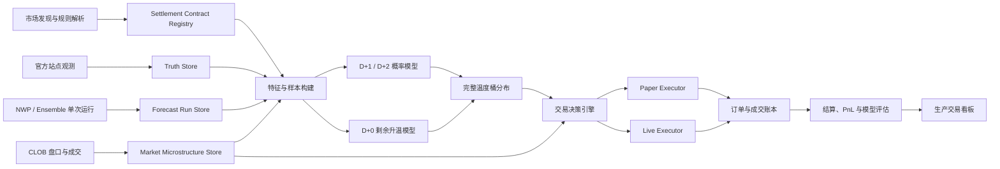

# WeatherBot v6 生产化整改蓝图

## 1. 产品目标

WeatherBot v6 的目标不是承诺稳定赚钱，而是建立一个能够持续验证交易优势的生产级天气交易平台：

- 每个概率都能追溯到真实的模型运行、站点观测和校准版本。
- 每个买入或跳过决定都能复现当时看到的数据。
- 模拟盘真实反映 spread、手续费、延迟、深度和成交概率。
- 实盘默认关闭，只有数据、模型、执行和风险门禁全部通过后才允许小额 canary。
- 看板首先回答“系统是否可信、为什么交易、为什么不交易”，其次才展示行情和视觉效果。

专业玩家流暂不进入核心决策，只保留为后续独立研究方向。

## 2. 当前系统判断

现有系统已经具备可继续演进的基础：

- FastAPI、React、SQLite 和后台扫描器已经可以运行。
- 已有市场规则、truth、forecast、orderbook、signal、paper/live order 等基础表。
- 已有整场温度桶归一化、truth health、paper executor、实盘 dry-run 和风险门禁雏形。
- 已有机场站点映射、多天气源、模拟账户和中文看板。

但当前仍不适合自动实盘，主要缺口按优先级排列如下：

### P0：数据时间轴不够严格

- 历史 forecast 未统一保证来自当时真实可见的模型运行。
- `run_at`、`valid_at`、`lead_hours`、`member`、`model_version` 没有成为强制字段。
- Open-Meteo Historical Forecast 的连续拼接产品可能被误当作固定提前量预报。
- 同一天多个扫描快照仍可能在部分统计中被当作多个样本。

### P0：结算 truth 仍未完全闭环

- 必须逐城市确认站点、当地日边界、单位、取整和最终归档来源。
- METAR 的逐时最高值不应默认等同最终日最高温。
- Open-Meteo archive 只能作为研究 fallback，不能解锁实盘。
- truth 修订、来源变化和人工校正需要保留审计历史。

### P0：概率模型仍偏启发式

- 当前主要依赖 Gaussian sigma、ensemble spread 和短样本 bias。
- 窄桶尾部容易被过宽 sigma 放大。
- D+0、D+1、D+2 尚未完全使用独立模型。
- 当前模型与市场严重分歧时，系统缺少强制的数据错位诊断。

### P0：模拟成交仍可能过于乐观

- 模拟盘需要使用盘口深度、订单排队、延迟、部分成交和撤单。
- 需要区分 maker GTC 与 taker 成交。
- 当前 mark-to-market 浮亏、真实已实现 PnL 和预测盈利展示仍需完全统一口径。

### P1：看板还是“模块集合”，不是决策工作台

- 地球视图占据过多首屏空间。
- 数据健康、策略版本、模型质量和订单状态分散在多个模块中。
- 信号的阻塞原因、数据血缘和决策链没有形成一条清晰阅读路径。
- 部分中文存在编码异常，必须在继续扩展 UI 前统一为 UTF-8。

## 3. 生产架构



系统拆成七个明确边界：

1. **Contract Registry**：市场规则与结算目标。
2. **Weather Data Platform**：预报运行、成员、逐小时路径、实时观测和 truth。
3. **Probability Engine**：点预测、误差修正、分布和市场桶映射。
4. **Decision Engine**：价格、成本、异常、风险和买入/跳过决策。
5. **Execution Engine**：paper/live 共用订单接口。
6. **Evaluation Platform**：walk-forward、模拟回放、结算和版本对比。
7. **Operations Dashboard**：运行、数据、模型、交易和风险控制。

## 4. 数据基座整改

### 4.1 Settlement Contract Registry

每个市场必须生成不可变的结算目标：

- `contract_id`
- `event_slug`
- `market_id`
- `city`
- `metric`
- `target_local_date`
- `station_id`
- `station_name`
- `timezone`
- `unit`
- `rounding_rule`
- `bucket_low`
- `bucket_high`
- `bucket_boundary_rule`
- `resolution_source_text`
- `resolution_url`
- `truth_provider_priority`
- `rule_version`
- `parsed_at`
- `manual_verified_at`

只有 `manual_verified_at` 非空且规则置信度达标的市场才能进入 live candidate。

### 4.2 Forecast Run Store

禁止只保存每日均值。每次预测必须保留：

- `provider`
- `model`
- `model_version`
- `run_at`
- `retrieved_at`
- `valid_at`
- `target_local_date`
- `lead_hours`
- `latitude`
- `longitude`
- `station_id`
- `member_id`
- 逐小时温度、露点、湿度、云量、风、降水和辐射
- 原始响应 hash
- 数据许可和来源 URL

成员级日最高温必须由当地结算日内的逐小时路径计算：

```text
member_daily_max = max(member_hourly_temperature within settlement local day)
```

Historical Forecast 连续拼接数据不得冒充 D+1/D+2 固定提前量训练样本。

### 4.3 Observation 与 Truth Store

实时观测和最终 truth 分表保存：

- 实时观测：用于 D+0 推理。
- 初步日最高温：用于监控，不立即进入训练。
- 最终归档 truth：用于训练、评估和结算。
- Polymarket 最终 outcome：用于交易胜负和 PnL。

Truth 必须带：

- `provider`
- `station_id`
- `observed_at`
- `local_date`
- `actual_high`
- `observation_count`
- `quality_flags`
- `is_preliminary`
- `is_final`
- `calibration_eligible`
- `truth_version`
- `supersedes_truth_id`

任何修订不得覆盖旧记录，而应新增版本。

### 4.4 Market Microstructure Store

每次扫描保存：

- best bid / ask
- 多档深度
- spread
- tick size
- order minimum
- 24h volume
- quote timestamp
- trade timestamp
- fee schedule
- market status
- 原始 orderbook hash

信号必须引用具体 `orderbook_snapshot_id`，不能只保存一个价格数字。

### 4.5 Decision Ledger

每次扫描都生成决策记录，包括跳过：

- 输入数据版本
- probability model version
- bucket distribution version
- model probability
- market probability
- gross edge
- spread cost
- fee estimate
- slippage estimate
- fill probability
- net executable edge
- paper/live gate 结果
- 主原因、次要原因和异常标记

这是未来复盘最重要的表，不能只记录 BUY。

## 5. 最高温算法路线

### 5.1 三条独立预测路径

#### D+1 / D+2

- 输入 ECMWF、GEFS/GFS 和区域 ensemble 的单次模型运行。
- 先计算成员级日最高温，再形成 empirical distribution。
- 使用 station、season、lead time 分层 MOS/EMOS 修正。
- 不再使用固定 sigma 直接外推窄桶概率。

#### D+0 早间

- 输入短临模型、当天模型运行、站点 morning observations。
- 特征包括 max-so-far、升温斜率、露点、云量、风向、辐射和降水。
- 输出最终最高温的条件分布。

#### D+0 临近峰值

目标改为预测剩余升温：

```text
remaining_rise = final_high - max_so_far
final_high = max(max_so_far, max_so_far + remaining_rise)
```

已经被观测超过上限的桶概率立即归零。退出依据是模型失效，而不是短时 bid 下跌。

### 5.2 校准层级

第一阶段使用可解释基线：

1. 原始 ensemble。
2. 滚动站点 bias。
3. 正则化 MOS / Huber residual correction。
4. EMOS：同时校准均值和方差。

第二阶段才引入 ML challenger：

- XGBoost/LightGBM 预测 NWP residual。
- 分位数模型预测 P10/P50/P90。
- 必须使用 walk-forward split。
- 禁止训练和预测时间不可获得的字段。
- 必须显著优于 EMOS 才能成为 champion。

### 5.3 完整桶概率

采用 Monte Carlo 或成员经验分布映射：

1. 从校准后的温度分布抽样。
2. 加入站点观测误差。
3. 应用单位转换和结算取整。
4. 映射到全部互斥市场桶。
5. 归一化为 `sum(probability)=1`。

低价尾部桶额外要求：

- `ask < 0.10` 时提高最小净 edge。
- 要求更低 spread、更高深度和模型一致性。
- 要求尾部 reliability 达标。
- 禁止仅因市场价格便宜而买入。

### 5.4 Champion / Challenger

同时运行但不同时下单：

- `champion`：当前生产概率。
- `challenger_mos`
- `challenger_emos`
- `challenger_ml`

看板持续比较每个版本的 MAE、CRPS、Brier、ROI 和最大回撤。模型升级必须通过版本门禁，不能直接覆盖。

## 6. 交易决策与执行

### 6.1 决策顺序

```text
规则和站点可信
  -> 数据未过期
  -> 概率分布通过校准
  -> 全部桶归一
  -> 数据错位检查
  -> 净 edge 扣除 spread/fee/slippage
  -> order minimum / tick / depth
  -> 风险预算与重复暴露
  -> paper 或 live executor
```

当模型与市场相差过大时，默认触发异常诊断，而不是自动认为发现巨大 edge：

- station mismatch
- timezone/date mismatch
- unit/rounding mismatch
- stale forecast run
- stale orderbook
- ensemble member missing
- truth calibration insufficient

### 6.2 Paper Executor

Paper 必须模拟：

- signal-to-order 延迟
- GTC maker 与 taker 两种模式
- 盘口队列和可成交深度
- partial fill
- cancel/replace
- reject
- fee
- mark-to-market spread

每笔订单状态：

```text
candidate -> submitted -> open -> partially_filled -> filled
          -> rejected / cancelled / expired
          -> settled
```

先看 fill rate，再看 PnL。成交率异常高意味着模拟可能失真。

### 6.3 Live Executor

第一阶段只允许：

- BUY YES
- 限价单
- `$1-$2` canary
- 白名单城市和白名单策略版本
- 幂等订单

一键熔断必须能：

- 禁止新订单
- 撤销所有未成交订单
- 保留现有持仓
- 记录操作者、时间和原因
- 发送飞书告警

## 7. 生产交易看板设计

### 7.1 设计原则

- 工作台优先，不做营销首页。
- 状态文字和数字优先于装饰图形。
- 不依赖颜色单独表达风险。
- 所有关键指标都显示数据时间和来源。
- 每个 BUY、SKIP、BLOCK 都能展开看到完整原因链。
- 采用当前黑色、紧凑、专业交易终端风格，但正文最小字号提高到 11-12px。
- 全项目统一 UTF-8，先清除乱码再扩展功能。

### 7.2 顶层导航

建议从单页三栏升级为七个工作区：

1. **运行总览**
2. **市场与信号**
3. **城市与站点**
4. **模拟交易**
5. **策略实验室**
6. **数据健康**
7. **实盘控制**

地球视图保留为“城市与站点”的辅助入口，不再占据运行总览的核心区域。

### 7.3 运行总览

首屏只回答六个问题：

1. 服务是否正常运行？
2. 数据是否新鲜、完整、可信？
3. 当前有多少真正可执行候选？
4. 模拟盘今天表现如何？
5. 有哪些风险或阻塞？
6. 实盘是否允许？

建议布局：

```text
顶栏：环境 PAPER/LIVE | 扫描器 | 数据年龄 | 模型版本 | 紧急停止

第一行：实盘准备度 | 数据健康 | 今日风险额度 | 服务健康

第二行：候选信号队列（主区域） | 今日模拟账户和资金曲线

第三行：阻塞原因分布 | 待结算持仓 | 最近风险事件
```

### 7.4 市场与信号

默认表格字段：

- 城市 / 日期
- 温度桶
- 模型概率
- 市场 ask
- 净 edge
- spread
- 模型状态
- truth 状态
- 行动

展开一行后按顺序展示：

1. 最终建议和一句话原因。
2. 完整温度桶分布。
3. forecast run 与成员信息。
4. 当前站点观测和 max-so-far。
5. orderbook 深度、预计成交和费用。
6. paper/live gate 原因。
7. Polymarket 原始链接。

不再将十几个 badge 平铺在行内。

### 7.5 城市与站点

每个城市有独立详情页：

- 结算规则和站点。
- 逐小时观测曲线。
- 各模型逐小时 forecast 曲线。
- 每次模型运行的最高温预测变化。
- 历史实际最高温与预测最高温。
- station bias、MAE、CRPS、Brier。
- 月份、风向、天气形势分组表现。
- 数据源健康和最后成功时间。

地图用于选择城市；详情页负责分析。

### 7.6 模拟交易

页面拆成：

- 模拟账户资金、现金、占用和回撤。
- open orders。
- partial fills。
- positions。
- settlements。
- 按策略版本的 PnL。
- BUY 与 SKIP 的结果对比。
- fill rate 和未成交原因。

资金曲线同时显示：

- 已实现权益。
- 含未实现的净值。
- 初始本金基线。
- 最大回撤区间。

### 7.7 策略实验室

用于判断算法是否真的变好：

- Champion vs challengers。
- Walk-forward 日期选择。
- 按城市、月份、时效、价格桶和数据源切片。
- MAE、CRPS、Brier、reliability、Top-1、Top-2。
- 扣除费用后的 paper ROI。
- 实验的 hypothesis、sample size、abandon line。

看板禁止只展示“预测 EV 很高”而隐藏实际结果。

### 7.8 数据健康

按数据链路显示 SLA：

- Market discovery
- Contract parsing
- Forecast providers
- METAR / official observations
- Truth finalization
- CLOB orderbook
- Settlement
- Feishu / AI provider

每项显示：

- 状态
- 最后成功
- 延迟
- 最近错误
- fallback
- 影响范围
- 恢复建议

### 7.9 实盘控制

只有此页面允许修改实盘状态：

- 钱包和 USDC 余额
- API/CLOB 连接
- 白名单城市
- 白名单模型版本
- 单笔、单日、持仓和回撤限额
- AI 审核开关
- canary dry-run
- 当前 open orders
- 一键熔断

启用实盘需要二次确认，并展示本次将启用的完整限额，而不是一个普通 toggle。

## 8. 看板公共状态模型

系统状态统一成四层：

### 服务状态

- healthy
- degraded
- offline

### 数据状态

- fresh
- stale
- incomplete
- fallback
- invalid

### 策略状态

- research
- paper_allowed
- canary_allowed
- live_allowed
- blocked

### 订单状态

- candidate
- skipped
- submitted
- open
- partial
- filled
- cancelled
- rejected
- settled

前后端必须共用同一枚举，禁止各模块自行发明“人工确认、空闲、观察”等含义不清的状态。

## 9. 实施阶段

### Phase 0：冻结与口径修复，3-5 天

- 创建 v5 当前版本 tag 和数据备份。
- 修复全项目 UTF-8 乱码。
- 形成城市/站点/结算源清单。
- 标记不可用于训练的历史 forecast 和 truth。
- 冻结当前模型为 `legacy_champion`。

验收：

- 页面无乱码。
- 每个活跃城市都有明确结算规则状态。
- 所有历史样本能区分 eligible / research-only / invalid。

### Phase 1：时间真实的数据基座，1-2 周

- 升级 forecast run、members、hourly values、truth revisions 和 orderbook snapshots。
- 给所有记录增加 source hash 和时间字段。
- 建立数据完整性任务和健康 API。
- 从 3 个城市开始构建可靠训练集：KLGA、KMIA、KSEA。

验收：

- 任意历史信号可以还原当时可见的 forecast 和 orderbook。
- D+1 样本不会读取目标日之后的数据。
- truth 修订可审计。

### Phase 2：基线概率引擎，1-2 周

- 实现成员级日最高温分布。
- 实现滚动 bias 和 MOS。
- 按 D+0/D+1/D+2 分离推理。
- 完成 rounding-aware bucket mapping。
- 建立 champion/challenger 评估。

验收：

- 所有事件桶概率之和为 1。
- walk-forward 无泄漏测试通过。
- MOS 至少不劣于原始 ensemble。

### Phase 3：真实模拟执行，1 周

- 引入延迟、深度、部分成交、GTC 和费用。
- 订单生命周期完整写库。
- 统一权益、净值、浮动 PnL 和已实现 PnL。
- 对每次 skip 记录明确原因。

验收：

- 相同快照和策略版本可以确定性重放。
- 无随机“假成交”。
- fill rate、费用和滑点可解释。

### Phase 4：生产看板重构，1-2 周

- 建立七个工作区。
- 将地球移动到城市页。
- 重做总览、信号详情、模拟账户、策略实验室和数据健康。
- 增加完整 loading、empty、stale、degraded 和 error 状态。
- 完成桌面 1440px、笔记本 1280px 和移动端只读适配。

验收：

- 用户在首屏 10 秒内能判断系统是否可交易。
- 任意 BUY/SKIP/BLOCK 可在两次点击内看到完整原因。
- 关键操作支持键盘和明确焦点。

### Phase 5：持续 paper 验证，至少 14-30 天

- 同时运行 legacy、MOS、EMOS challenger。
- 每日自动结算和生成飞书摘要。
- 固定策略版本，不因短期亏损追调参数。
- 每个实验提前定义 abandon line。

验收：

- 至少 50 个候选和 30 个独立结算持仓。
- truth coverage >= 90%。
- 净费用后 ROI 为正。
- 最大回撤和尾部桶表现满足门槛。
- allowed group 明显优于 blocked group。

### Phase 6：实盘 canary

- 先跑 CLOB dry-run。
- 只开放 `$1-$2`、单城市、单模型版本。
- 每笔实盘发送飞书。
- 任意异常自动关闭新订单。

验收：

- 余额、tick、order minimum、重复订单、过期盘口和熔断测试全部通过。
- canary 成交与本地账本、Polymarket 账本一致。
- 未经人工提升限额不得自动扩大仓位。

## 10. 测试体系

### 数据测试

- 站点、时区和当地日边界。
- forecast run 时间不能晚于决策时间。
- member 数量和逐小时完整性。
- truth provider 优先级和修订。
- orderbook snapshot 新鲜度。

### 模型测试

- 无未来特征。
- walk-forward split。
- 桶边界和取整。
- 分布归一。
- 尾部概率和 D+0 硬下界。
- champion/challenger 可重放。

### 执行测试

- tick size。
- orderMinSize。
- 深度不足。
- partial fill。
- stale quote。
- duplicate idempotency。
- daily loss 和 drawdown 熔断。

### 产品测试

- 所有状态文案为中文且无乱码。
- 表格展开无重叠。
- 关键图表不依赖 hover 才能理解。
- 键盘焦点、ARIA 名称和颜色对比。
- 后端断开、数据过期和 provider 降级均有清晰提示。

## 11. 上线指标

天气模型指标：

- MAE / RMSE
- CRPS
- PIT / rank histogram
- Brier score
- Reliability
- Top-1 bucket accuracy
- Top-2 bucket coverage

交易指标：

- candidate count
- order submission rate
- fill rate
- partial fill rate
- gross edge
- executable net edge
- realized edge
- fee / spread / slippage
- ROI
- max drawdown

系统指标：

- scan latency
- dashboard API latency
- source freshness
- provider failure rate
- truth coverage
- stale decision rate
- duplicate-order prevention count

## 12. 明确不做

本轮不把以下内容作为核心：

- 根据 X 热度或新闻让 LLM 直接决定交易。
- 直接复制所谓专业玩家。
- 自训大型神经天气模型。
- 用历史实际天气代替历史预报运行。
- 因单笔高 EV 或短期盈利直接开放实盘。
- 为了视觉效果继续扩大地球、动画和装饰模块。

## 13. 最终交付顺序

1. 数据资格审计报告。
2. 城市结算规则注册表。
3. Forecast Run 与 Truth Store v2。
4. 无泄漏的三城市 walk-forward 数据集。
5. Baseline / MOS / EMOS 对比报告。
6. 真实 paper executor。
7. 七工作区生产看板。
8. 14-30 天 paper 验证报告。
9. CLOB canary dry-run。
10. `$1-$2` 实盘 canary。

这套顺序的原则是：先证明数据真实，再证明概率可靠，然后证明订单可成交，最后才允许真钱进入系统。
